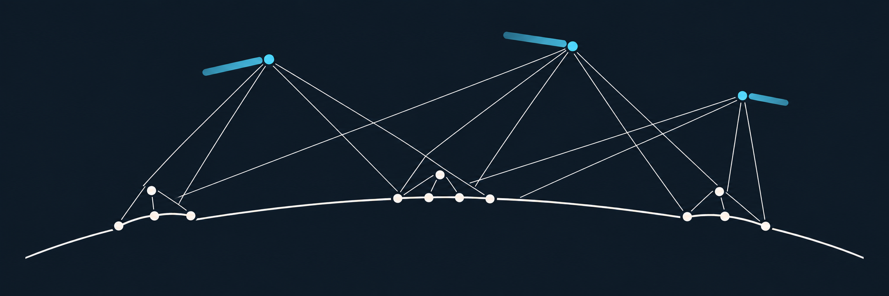

# Project Vesida

**Open tools for observing what orbits the Earth.**

Project Vesida develops open hardware and software for building and operating independent optical
satellite-tracking arrays. Each array combines several fixed, wide-field optical nodes with one
local agent. It observes the sky, detects moving objects and produces tracklets: compact
measurements of an object's path across a sequence of images.

The array belongs to the person or group that builds and operates it. The images, measurements and
tracklets it produces belong to them as well. Operators may opt in to share selected tracklets with
a wider network; participation does not require publishing local data.

Shared observations can support open catalogs, independent verification and better collective
awareness of activity in Earth orbit. Vesida's role is to make independently operated arrays useful
on their own and interoperable when their operators choose to collaborate.

## Principles

- **Local ownership:** operators control their arrays and the data they produce.
- **Opt-in sharing:** tracklets are shared only when their owner chooses to publish them.
- **Open implementation:** reference hardware, software and interfaces are developed in public.
- **Interoperability:** common formats let independent arrays contribute without giving up control.

## Repositories

| Repository | Purpose | Licence |
|---|---|---|
| [opta-engineering](https://github.com/project-vesida/opta-engineering) | Requirements, interfaces and verification | CERN-OHL-S v2 |
| [opta-model](https://github.com/project-vesida/opta-model) | Radiometry, error budgets, hardware modeling and array optimization | Apache-2.0 |
| [opta-pipeline](https://github.com/project-vesida/opta-pipeline) | Image processing and tracklet generation | Apache-2.0 |
| [opta-hardware](https://github.com/project-vesida/opta-hardware) | Reference optical-node hardware | CERN-OHL-S v2 |
| [vesida-agent](https://github.com/project-vesida/vesida-agent) | Local array scheduling, capture and processing | AGPL-3.0 |
| [vesida-platform](https://github.com/project-vesida/vesida-platform) | Optional tracklet sharing and open catalog services | AGPL-3.0 |

OpTA, the Optical Transit Array, is the first reference instrument developed by Project Vesida. A
complete array combines multiple optical nodes with one local `vesida-agent` instance.

Project Vesida is the organization coordinating this work. Its future legal form has not been
decided.

Contributions are accepted under each repository's licence with a Developer Certificate of Origin
sign-off (`git commit -s`).
